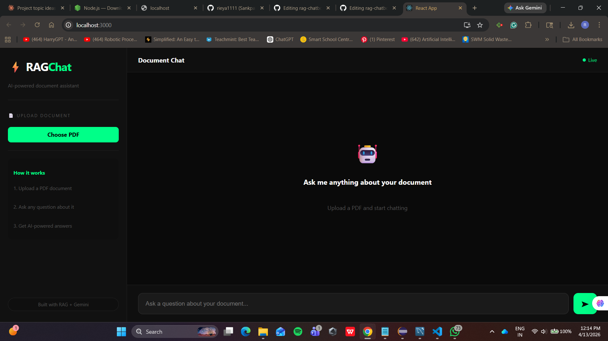

# RAGChat - AI Document Chatbot

An AI-powered chatbot that lets you upload PDF documents and ask questions about them in plain English.

## 🚀 Features
- Upload any PDF document
- Ask questions in natural language
- Get accurate AI-generated answers using RAG
- Clean dark-mode chat interface

## 🛠️ Tech Stack
| Layer | Technology |
|---|---|
| Frontend | React.js |
| Backend | Spring Boot + MySQL |
| AI Engine | Python + FastAPI |
| Vector DB | ChromaDB |
| LLM | Google Gemini |
| Embeddings | Sentence Transformers |

## 🧠 How RAG Works
1. PDF uploaded → text extracted → split into chunks
2. Chunks converted to embeddings → stored in ChromaDB
3. User asks question → question converted to embedding
4. Most similar chunks retrieved → sent to Gemini as context
5. Gemini generates accurate answer from context

## ⚙️ Setup & Run

### Python RAG Engine
```bash
cd rag-engine
python -m venv venv
venv\Scripts\activate
pip install -r requirements.txt
uvicorn main:app --reload
```

### Spring Boot Backend
- Open in Eclipse
- Configure MySQL in application.properties
- Run BackendApplication.java

### React Frontend
```bash
cd frontend
npm install
npm start
```

## 📸 Screenshot


## 👩‍💻 Author
Riya Sankpal - Computer Engineering Student, ADYPU Pune